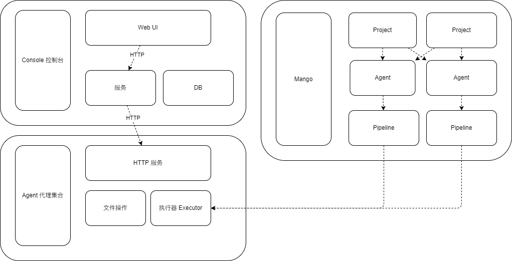

# README

A lightweight CI tool for your webapp 😄.

## User Guider

1st. create a database called mango

[DB_MySQL](./mysql/README.md)

2nd. running the backend service and its ui

[Console-Service](./console/README.md)

[Console-UI](./console/client/README.md)

3rd. running at least one runner and checkin it to the service⬆

[Mango-Runner](https://github.com/daijinru/mango-runner)

